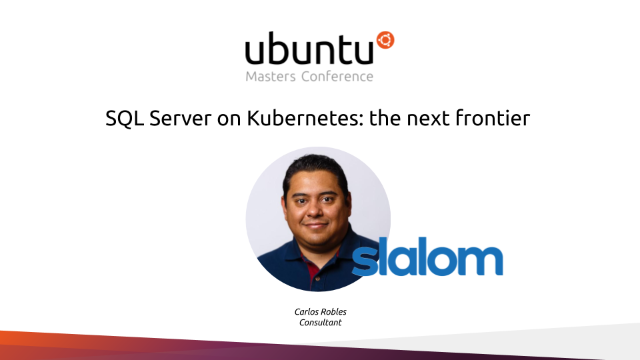

# Ubuntu Masters Conference
## [SQL Server on Kubernetes: The next frontier](https://www.brighttalk.com/webcast/6793/453228)

Data professionals were caught by surprise when IT shops started to introduce VMs for SQL Server workloads 15 years ago. As it usually happens with new technologies, there was some hesitation at the beginning; however, it was a quick turnaround until they become the standard today. So, you may ask yourself today, are containers going down the same road? Do I have to be prepared for this containers / Kubernetes thing?

The answer is yes! Containers are not necessarily a replacement to VMs or whatsoever. In reality, they will make an excellent addition to your technology stack that could help you to solve software problems.

This session will provide you best practices, methods, and practical solutions to help you manage your SQL Server workloads on Kubernetes hosted in Ubuntu whether on-premises using MicroK8s or cloud services like AKS.

You will be able to use Kubernetes to perform near to zero downtime version upgrades, set up high availability, and accomplish agile database deployments at the end of this session.

## **Prerequisites**  
* Basic Linux experience
* Experience with database and software development
* Familiarity with containers

## **Demos**  
* [SQL Server deployment on Microk8s](Demo_01)
* [SQL Server connectivity](Demo_02)
* [SQL Server version upgrade on AKS](Demo_03)
* [SQL Server HA through Kubernetes](Demo_04)

## Questions?
If you have questions or comments about this demo, don't hesitate to contact me at <crobles@dbamastery.com>

## Follow me
   